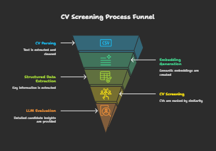
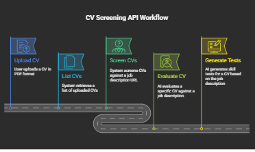

# AI CV Screening Platform

An AI-powered CV screening platform that automates candidate evaluation against job postings.  
It combines **embedding-based semantic matching**, **structured data extraction**, and **LLM evaluation** to rank CVs and generate skill tests.

Inspired by the multi-agent resume screening framework ([arXiv:2504.02870v1](https://arxiv.org/abs/2504.02870)).






---

## Features

- Upload and store CVs in PDF format.
- List all uploaded CVs.
- Screen CVs against a job posting URL using:
  - Semantic similarity (embedding-based)
  - Structured data matching (experience, skills, education, certifications)
- Evaluate individual CVs with LLMs:
  - Relevance score
  - Strengths & weaknesses
  - Shortlist/reject recommendation
- Generate skill tests for candidates based on extracted skills.
- Web UI for uploading CVs, entering job URLs, and viewing results.

---

## Tech Stack

- **Backend:** Python, FastAPI, PyPDF2, Sentence Transformers, OpenAI API
- **Frontend:** React, Tailwind CSS
- **Database:** None (CVs stored locally in `api/data`)
- **LLM:** OpenAI GPT or HF-hosted LLM for parsing CVs and generating evaluations/tests

---

## Installation

1. **Clone the repository:**
```bash
git clone https://github.com/yourusername/cv-screening-app.git
cd cv-screening-app
```


## Screenshots
Here are some screenshots of the application:


Demo:

https://github.com/user-attachments/assets/69244871-33ac-4fa1-b53f-23c7cec8d174


